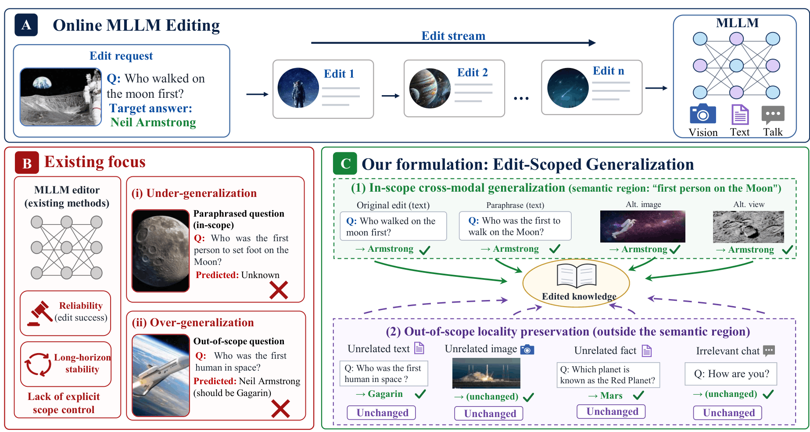
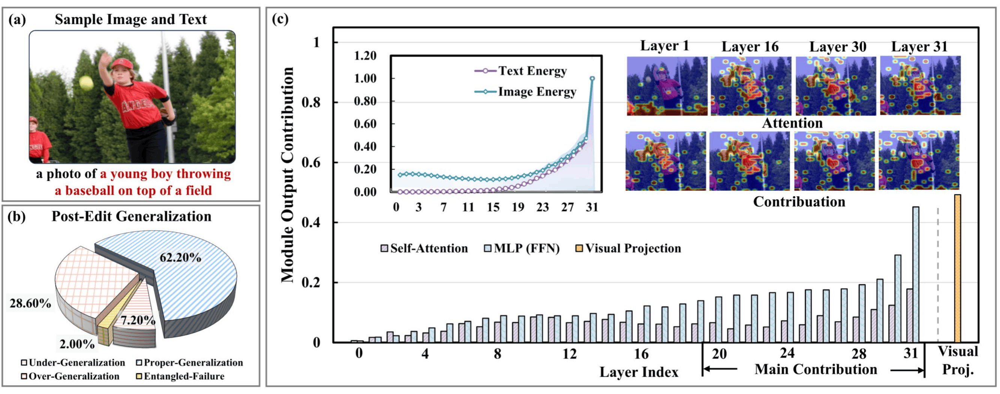

<div align="center">

# ScopeEdit

**Multimodal Knowledge Edit-Scoped Generalization for Online Recursive MLLM Editing**

<p>
  <b>Scope-aware online editing</b> ·
  <b>Cross-modal generalization</b> ·
  <b>Constant per-edit overhead</b>
</p>

<p>
  
  
  
  
  
</p>

<p>
  <a href="#overview">Overview</a> |
  <a href="#quick-start">Quick Start</a> |
  <a href="#data-preparation">Data</a> |
  <a href="#model-preparation">Models</a> |
  <a href="#evaluation">Evaluation</a> |
  <a href="#acknowledgement">Acknowledgement</a> |
  <a href="#citation">Citation</a>
</p>

<p>
  <a href="assets/readme/scopeedit_intro.png"><b>Motivation Figure</b></a> ·
  <a href="assets/readme/scopeedit_pilot.png"><b>Pilot Study Figure</b></a> ·
  <a href="./MMEdit.md"><b>MMEdit Notes</b></a> ·
  <a href="https://github.com/zjunlp/EasyEdit"><b>EasyEdit</b></a>
</p>

</div>

ScopeEdit is a scope-aware online editor for multimodal large language models. Instead of only asking whether an edit succeeds on the original request, ScopeEdit controls where the edited knowledge is allowed to propagate and where it should remain invisible.

<p align="center">
  
</p>

## Overview

ScopeEdit reframes online multimodal editing as **Edit-Scoped Generalization**: each edit should be absorbed reliably, propagate only to semantically supported image-text variants, and remain inactive on unrelated inputs.

The method implements this principle through three coupled mechanisms:

- **Modality-local absorption**: an always-active local branch writes the current correction into modality-local edit geometry, supporting reliable absorption while preserving out-of-scope locality.
- **Evidence-gated shared propagation**: a shared branch is activated only when textual and visual evidence are both directionally aligned and comparably supported, enabling warranted cross-modal transfer while suppressing leakage.
- **Scope-separated recursive geometry**: local and shared branches use fixed orthogonal low-rank write coordinates and maintain separate history-only preconditioners, updated with Sherman--Morrison recursions for constant per-edit overhead.

### Pilot Observation

<p align="center">
  
</p>

Our pilot study shows that reliable edits are not necessarily scope-correct. Among already successful edits, only `62.20%` achieve proper generalization; `28.60%` under-generalize to in-scope variants, `7.20%` over-generalize to out-of-scope inputs, and `2.00%` suffer from entangled failures. Layer-wise analysis further shows that cross-modal edit responses concentrate in deeper semantic layers, motivating evidence-gated shared propagation in ScopeEdit.

## Quick Start

Install the environment:

```bash
python -m venv .venv
source .venv/bin/activate
pip install --upgrade pip
pip install -r easyedit_pip.txt
```

This repository focuses on two core configurations:

| Config | Backbone | Default Tasks |
| :-- | :-- | :-- |
| `hparams/TRAINING/MORE/llava15_scopeedit.yaml` | LLaVA-v1.5-7B | E-IC / E-VQA |
| `hparams/TRAINING/MORE/blip2_scopeedit.yaml` | BLIP-2 OPT-2.7B | E-IC / E-VQA |

## Data Preparation

This repository uses the multimodal editing data from MMEdit. The required download links are listed below. For the original data description and detailed locality setup, see [MMEdit.md](./MMEdit.md).

| Data | Link | Usage |
| :-- | :-- | :-- |
| E-IC | [Google Drive](https://drive.google.com/drive/folders/1jBdTJxUb9wEeHnvG-RY8dv5_I4QlDpUS?usp=drive_link) | Image captioning editing |
| E-VQA | [Google Drive](https://drive.google.com/drive/folders/1jBdTJxUb9wEeHnvG-RY8dv5_I4QlDpUS?usp=drive_link) | Visual question answering editing |
| Images | [Google Drive](https://drive.google.com/file/d/1fQzJBFkok5kFZT6QUuT-HCuYKk2Vb93O/view) | Shared images for E-IC and E-VQA |

Place data and images under:

```text
/root/autodl-tmp/data
├── editing-data
└── <image folders>
```

If your data or image root is different, update `coco_image` and `rephrase_image` in the corresponding YAML config.

## Model Preparation

The default paths below match the provided YAML configs. You may use different local paths as long as the YAML files are updated accordingly.

### LLaVA-v1.5-7B

`llava15_scopeedit.yaml` expects a local Transformers-format LLaVA-v1.5-7B checkpoint:

```text
/root/autodl-tmp/models/llava-v1.5-7b
```

Download:

```bash
mkdir -p /root/autodl-tmp/models
huggingface-cli download llava-hf/llava-1.5-7b-hf \
  --local-dir /root/autodl-tmp/models/llava-v1.5-7b
```

Model page: `https://huggingface.co/llava-hf/llava-1.5-7b-hf`

### BLIP-2 OPT-2.7B

`blip2_scopeedit.yaml` expects:

```text
/root/autodl-tmp/models/opt-2.7b
/root/blip_models/blip2_pretrained_opt2.7b.pth
/root/blip_models/eva_vit_g.pth
```

Download OPT-2.7B:

```bash
mkdir -p /root/autodl-tmp/models
huggingface-cli download facebook/opt-2.7b \
  --local-dir /root/autodl-tmp/models/opt-2.7b
```

Model page: `https://huggingface.co/facebook/opt-2.7b`

Download BLIP-2 vision-side checkpoints:

```bash
mkdir -p /root/blip_models
wget -O /root/blip_models/blip2_pretrained_opt2.7b.pth \
  https://storage.googleapis.com/sfr-vision-language-research/LAVIS/models/BLIP2/blip2_pretrained_opt2.7b.pth
wget -O /root/blip_models/eva_vit_g.pth \
  https://storage.googleapis.com/sfr-vision-language-research/LAVIS/models/BLIP2/eva_vit_g.pth
```

MiniGPT-4 checkpoints are not part of the main ScopeEdit reproduction path. For the original MMEdit setup, see [MMEdit.md](./MMEdit.md).

## Path Check

Before evaluation, verify the local paths in the two core configs.

```yaml
# hparams/TRAINING/MORE/llava15_scopeedit.yaml
model_name: /root/autodl-tmp/models/llava-v1.5-7b
tokenizer_name: /root/autodl-tmp/models/llava-v1.5-7b
coco_image: /root/autodl-tmp/data
rephrase_image: /root/autodl-tmp/data
```

```yaml
# hparams/TRAINING/MORE/blip2_scopeedit.yaml
name: /root/autodl-tmp/models/opt-2.7b
tokenizer_name: /root/autodl-tmp/models/opt-2.7b
qformer_checkpoint: /root/blip_models/blip2_pretrained_opt2.7b.pth
state_dict_file: /root/blip_models/eva_vit_g.pth
coco_image: /root/autodl-tmp/data
rephrase_image: /root/autodl-tmp/data
```

## Evaluation

Run ScopeEdit with one of the following commands.

### LLaVA-v1.5 on E-IC

```bash
python test_scopeedit_multisteps.py \
  hparams/TRAINING/MORE/llava15_scopeedit.yaml \
  --train-ds /root/autodl-tmp/data/editing-data/caption/caption_train_edit.json \
  --test-ds /root/autodl-tmp/data/editing-data/caption/caption_eval_edit.json \
  --warmup-iters 10 \
  --n-edits 100 \
  --edit-steps 1,10,20,30,100 \
  --more-steps 5
```

### BLIP-2 OPT on E-IC

```bash
python test_scopeedit_multisteps.py \
  hparams/TRAINING/MORE/blip2_scopeedit.yaml \
  --train-ds /root/autodl-tmp/data/editing-data/caption/caption_train_edit.json \
  --test-ds /root/autodl-tmp/data/editing-data/caption/caption_eval_edit.json \
  --warmup-iters 10 \
  --n-edits 100 \
  --edit-steps 1,10,20,30,100 \
  --more-steps 5
```

### E-VQA

E-VQA does not require a separate config. Use one of the core YAML files above and replace the dataset paths. The script automatically selects the dataset class when the path contains `vqa`.

```bash
python test_scopeedit_multisteps.py \
  hparams/TRAINING/MORE/llava15_scopeedit.yaml \
  --train-ds /root/autodl-tmp/data/editing-data/vqa/vqa_train.json \
  --test-ds /root/autodl-tmp/data/editing-data/vqa/vqa_eval.json \
  --warmup-iters 10 \
  --n-edits 100 \
  --edit-steps 1,10,20,30,100 \
  --more-steps 5
```

For BLIP-2, replace the config with `hparams/TRAINING/MORE/blip2_scopeedit.yaml`.

## Output

The script prints warmup status, online sequential editing results, and frozen-parameter evaluation results. Default output directories:

```text
/root/autodl-tmp/results/SCOPEEDIT_Eval_LLaVA15
/root/autodl-tmp/results/SCOPEEDIT_Eval_BLIP2_OPT
```

## Repository Layout

```text
.
├── test_scopeedit_multisteps.py      # Main evaluation entry point
├── test_bridge_multisteps.py         # Backward-compatible wrapper
├── scopeedit_eval_utils.py           # Online editing evaluation helpers
├── hparams/TRAINING/MORE             # ScopeEdit / M-ORE configs
├── easyeditor                        # Model, dataset, and trainer code
├── assets/readme                     # README figures
├── MMEdit.md                         # Original MMEdit data notes
└── easyedit_pip.txt                  # pip dependencies
```

## Acknowledgement

This implementation is built on top of [EasyEdit](https://github.com/zjunlp/EasyEdit). We thank the EasyEdit authors and community for providing the model-editing infrastructure.

For multimodal data preparation and the original MMEdit notes, see [MMEdit.md](./MMEdit.md). It preserves the MMEdit dataset links, image files, and checkpoint preparation details used for reproduction checks.

## Citation

```bibtex
@article{li2026modality,
  title={Modality-Decoupled Online Recursive Editing},
  author={Li, Siyuan and Zhang, Youyuan and Liu, Fangming and Li, Jing},
  journal={arXiv preprint arXiv:2605.20273},
  year={2026}
}
```
